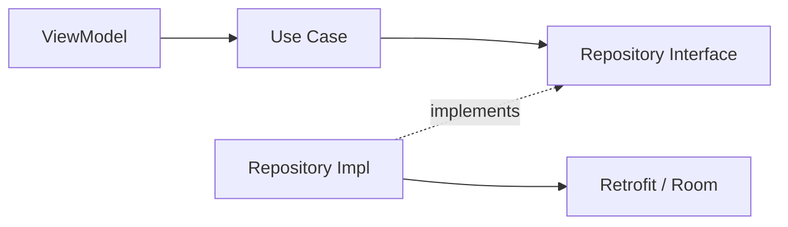

Most articles explaining Clean Architecture start with the concentric-circles diagram and a definition of the dependency rule. That part is easy to learn and easy to forget, because it doesn't explain *why* you'd pay the cost of extra layers and indirection on a real, shipping codebase.

Here's the version grounded in what actually breaks first when a banking app skips it.

## The failure mode it prevents

A credit-card application flow touches eligibility rules, KYC status, limit calculations, and a handful of backend services. Without a domain layer, that logic tends to live directly inside a ViewModel, importing Retrofit DTOs and Room entities straight into decision-making code.

That works fine — until:

- The backend team renames a field, and now a business rule three call-sites away silently breaks.
- QA asks you to write a unit test for "credit limit increase requires 3 months of on-time payments," and you discover the rule is entangled with `LiveData`, `Context`, and a Retrofit response class, so the "unit test" needs an emulator.
- A second screen needs the same eligibility rule, and the fastest path is copy-pasting it rather than reusing it, because it's not isolated anywhere reusable.

None of these are hypothetical — they're the standard cost of business logic that isn't separated from the frameworks around it.

## What the dependency rule actually buys you



*Only the implementation knows about Retrofit or Room — the use case never does.*

The use case (`IncreaseCreditLimitUseCase`) depends only on a `CardRepository` interface it owns. The concrete implementation — the one that actually knows about Retrofit and Room — lives in the data layer and depends *inward* on that interface. A backend contract change is a mapper change, not a use-case change.

```kotlin
class IncreaseCreditLimitUseCase(
    private val cardRepository: CardRepository,
) {
    suspend operator fun invoke(cardId: String, requestedLimit: Money): Result<CreditLimitDecision> {
        val history = cardRepository.getPaymentHistory(cardId)
        if (!history.hasOnTimePaymentsFor(months = 3)) {
            return Result.failure(IneligibleForIncreaseException())
        }
        return cardRepository.requestLimitIncrease(cardId, requestedLimit)
    }
}
```

That function runs in a plain JVM unit test in milliseconds. No emulator, no `Context`, no mocking Android framework classes.

## Where it's genuinely overkill

Not every screen deserves this treatment. A static "About" or "Terms & Conditions" screen has no business logic worth isolating — wrapping it in use cases and repository interfaces is pure ceremony. The judgment call is always: *is this logic complex, reused, or long-lived enough to be worth the indirection?* Applying the same rigor everywhere regardless of module size is its own architecture smell — see the [Clean Architecture reference page](/architecture/clean-architecture) for the fuller pros/cons breakdown.

## The real lesson

The dependency rule isn't a style preference — it's what determines whether a banking app's core rules survive a UI rewrite, a backend migration, or a new engineer's first week untouched. On the Emirates NBD Cards module, that separation was the reason modularization was tractable at all: the domain logic didn't have to be rebuilt when the surrounding UI and data layers were.
